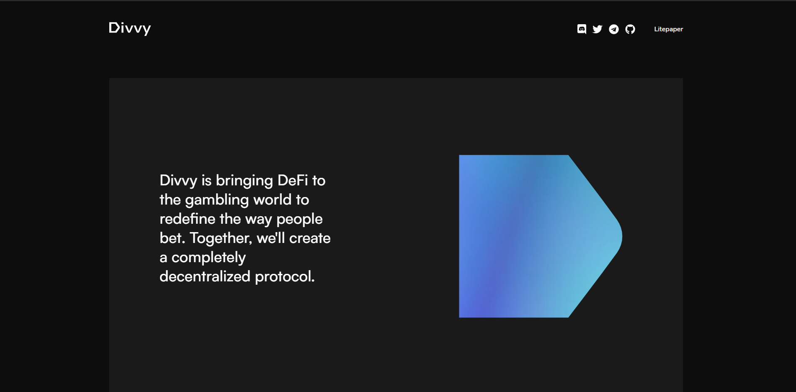
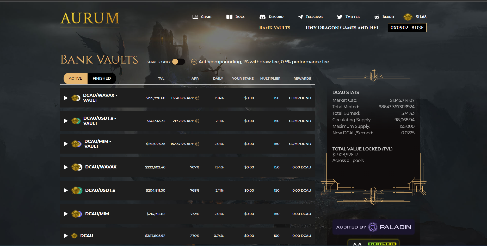
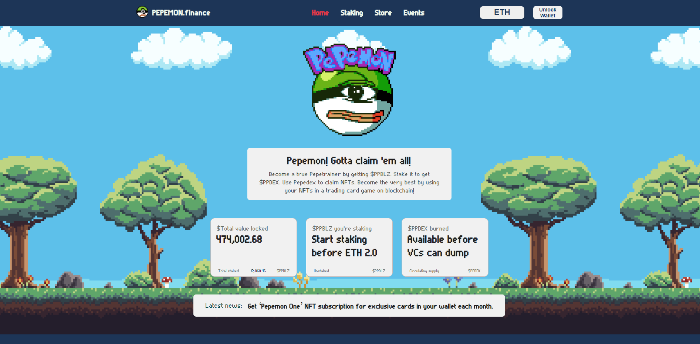
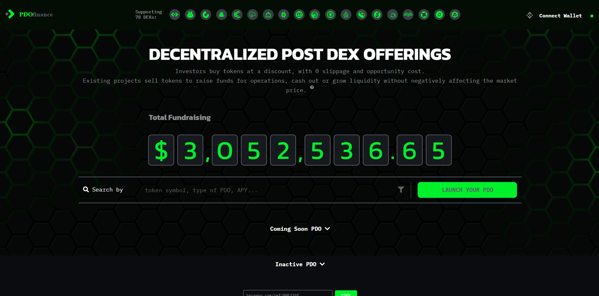
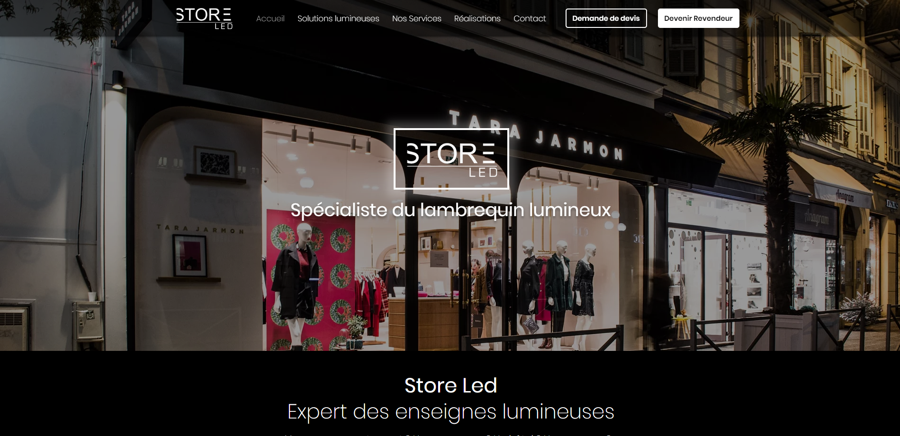
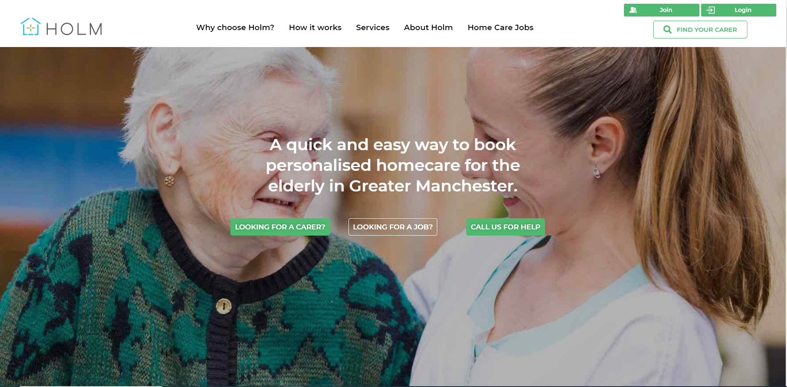

### 👨👩 Glad to see you here! &nbsp;

I'm a Full-Stack & Blockchain developer, Blockchain Enthusiast who loves to work with JavaScript/Typescript, Web3, Solidity, Blockchain (Ethereum, Binance Smart Chain, Polygon, Avalanche, Solana). Since 2019, I began proactively working on blockchain related projects as a Blockchain Software Engineer.

Nowadays, I'm mainly focused on working with any kind of NFT Minting, NFT Marketplace, DeFi Platform Development and have significant experience in bridge development between multi blockchain networks.

### 𝐒𝐤𝐢𝐥𝐥s
<table>
  <tr>
      <td></td>
      <td></td>
      <td></td>
      <td></td>
      <td></td>
      <td></td>
      <td></td>
      <td></td>
      <td></td>
      <td></td>
      <td></td>
      <td></td>
      <td></td>
      <td></td>
      <td></td>
  </tr>  
</table>

### Projects
<table>
    <thead align="center">
        <tr>
            <td><a href="https://divvy.bet/">DIVVY</a></td>
            <td><a href="https://app.hunterdoge.com/">HunterDoge</a></td>
            <td><a href="https://aurum.dragoncrypto.io/">Dragon Crypto Gaming</a></td>
            <td><a href="https://pepemon.world/">Pepemon</a></td>           
            <td><a href="https://dynamicswap.exchange/">Dynamic Swap</a></td>
        </tr>
    </thead>
    <tbody>
        <tr>
            <td>
                
            </td>  
            <td>
                
            </td>
            <td>
                
            </td>
            <td>
                
            </td>           
            <td>
              
            </td>
        </tr>
  </tbody>
</table>
<table>
  <thead align="center">
      <tr>
          <td><a href="https://legaltechnologyhub.com/">LegalTtechnologyHub</a></td>
          <td><a href="https://klassroom.co/">Klassroom</a></td>       
          <td><a href="https://www.storeled.fr/">StorLed</a></td>    
          <td><a href="https://www.screensaver.world/">ScreenSaverWorld</a></td>      
          <td><a href="https://holmcare.com/">HolmCare</a></td>
      </tr>
  </thead>
  <tbody>
    <tr>
        <td>
            
        </td>
        <td>
            
        </td>           
        <td>
            
        </td>
        <td>
            
        </td> 
        <td>
            
        </td>                      
    </tr>
  </tbody>
</table>

📈 **My GitHub Stats(2021):**

  
  

- 🔭 I’m currently working on Blockchain Projects
- 🤔 I’m looking for help with building NFT, DeFi, DEX Platform
- 🌱 I’m currently learning Go and Rust
- 🚀 Availability: Full-Time Supporting 40hrs/week
- 💬 Ask me about Web and Blockchain development
- 😄 Pronouns: Blockchain Enthusiast Guy

